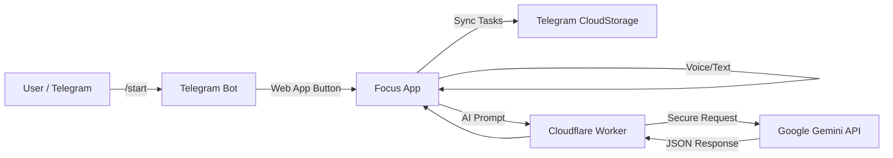

# Focus

**Focus** is a minimalist, AI-powered task manager designed exclusively for **Telegram Mini Apps**. It uses Google Gemini models to intelligently parse voice or text commands into structured tasks, organizing them by context (Daily Tasks, Long-term goals, Routines).

  

**Live Demo:** [https://enkinvsh.github.io/focus/](https://enkinvsh.github.io/focus/)

---

## Key Features

- **AI-Powered Entry:** Say "Buy milk" or "Learn Python". The AI extracts the title, assigns priority, and categorizes it based on your current tab context.
- **Breathing Exercise:** 1-minute guided breathing technique (4-4-4 pattern) to improve concentration before work. Tap the "Focus" title to start.
- **Cloud Sync:** Uses **Telegram CloudStorage** to sync tasks across all your devices without requiring login or external database.
- **Secure Architecture:** API Keys are hidden behind a **Cloudflare Worker** proxy. No sensitive data is exposed to the client.
- **Voice Control:** Native Web Speech API integration for hands-free task addition.
- **Premium UI/UX:**
  - Glassmorphism design with Tailwind CSS
  - Swipe gestures for tab navigation
  - Haptic feedback for native app feel
  - 4 OLED-friendly dark themes
  - Animated start screen with entrance effects
- **Localization:** Fully translated into English and Russian with auto-detection.

---

## Architecture



---

## Installation & Setup

### 1. Frontend (GitHub Pages)

The app is a single `index.html` file.

1. Fork this repository.
2. Enable **GitHub Pages** in repository settings (Source: `main` branch).
3. The app is ready to be added to Telegram via BotFather.

### 2. Backend (Cloudflare Worker)

The `worker.js` file contains both the Telegram bot logic and the Gemini API proxy.

1. Log in to [Cloudflare Dashboard](https://dash.cloudflare.com/).
2. Go to **Workers & Pages** -> **Create Worker**.
3. Paste the contents of `worker.js`.
4. **Settings -> Variables**: Add:
   - `GEMINI_KEY` - Your Google AI Studio API key
   - `BOT_TOKEN` - Your Telegram bot token from @BotFather
5. Deploy and copy the Worker URL.
6. Set up webhook for your bot: `https://api.telegram.org/bot<TOKEN>/setWebhook?url=<WORKER_URL>`
7. Update the `PROXY_URL` constant in `index.html` with your Worker URL.

### 3. BotFather Commands

Set these commands in @BotFather -> Edit Bot -> Edit Commands:

```
start - Launch app
help - Guide
about - About
```

---

## Bot Commands

| Command | Description |
|---------|-------------|
| `/start` | Shows welcome message with app launch button and breathing exercise info |
| `/help` | Displays usage guide with gestures and features |
| `/about` | Shows version, technologies, and privacy information |

The bot automatically detects user language (English/Russian) from Telegram settings.

---

## Usage

1. **Start:** Open the bot and tap "Launch Focus" or "Breathing Exercise"
2. **Add Tasks:** Tap the microphone button and speak, or type your task
3. **Categories:**
   - **TASK:** Immediate actions
   - **LONG:** Long-term goals
   - **ROUTINE:** Recurring habits
4. **Gestures:**
   - Swipe Left/Right to switch tabs
   - Tap a task for action menu (Done, Priority, Delete)
   - Tap "Focus" title for breathing exercise
5. **Breathing:** Tap the circle to pause/resume, or exit early

---

## File Structure

```
focus/
├── index.html      # Main application (SPA)
├── worker.js       # Cloudflare Worker (Bot + Gemini Proxy)
├── enter.png       # Bot welcome image
├── promo_banner.png
├── bot_avatar.png
└── README.md
```

---

## Changelog

### v0.0.3 (Focus Edition)
- **New:** Breathing exercise feature (1-min, 4-4-4 pattern)
- **New:** Premium animated start screen
- **New:** Tap-to-pause breathing with Continue/Exit menu
- **New:** Bot commands /help and /about
- **New:** Auto language detection in bot
- **UX:** Removed sync overlay, background loading
- **Bot:** Enhanced welcome message with feature list

### v0.0.2 (Cloud Edition)
- **New:** Telegram CloudStorage integration for cross-device sync
- **Security:** Cloudflare Worker proxy integration
- **UX:** Added "Syncing" overlay state
- **Fix:** Modal backdrop click issues resolved

### v0.0.1 (Initial Release)
- Core AI Task extraction
- Localization (EN/RU)
- Manrope Font & Tailwind styling

---

## Privacy

- All task data is stored exclusively in Telegram CloudStorage
- No external databases or third-party accounts required
- Gemini API requests are proxied through Cloudflare Worker (API key never exposed to client)
- No analytics or tracking

---

## License

MIT

---

**Built with AI & Human Collaboration**
